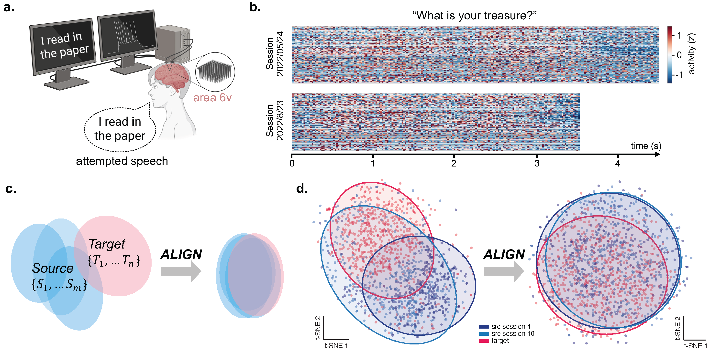

<h1 align="center">ALIGN: Adversarial Learning for Generalizable Speech Neuroprosthesis</h1>

<p align="center">
  Zhanqi Zhang · Shun Li · Bernardo L. Sabatini · Mikio Aoi · Gal Mishne
</p>

<p align="center">
  <a href="https://arxiv.org/abs/2603.18299"></a>
  <a href="LICENSE"></a>
  
  
  
</p>

<p align="center">
  
</p>
<p align="center">
  <em><b>Dataset and domain shift across sessions.</b> (a) Attempted-speech intracortical recordings from a
  participant with ALS. (b) The same sentence produces session-dependent neural dynamics across two sessions.
  (c) Nonstationarities induce a distribution shift between source and target sessions, which adaptation makes
  session-invariant. (d) t-SNE of the phoneme-decoding latent embeddings for source (blue) and target (red)
  sessions before and after ALIGN.</em>
</p>

This repository contains the essential code to reproduce the results in the ALIGN
paper. It is intentionally minimal: only the training, adaptation, and evaluation
code needed to replicate the reported numbers is included.

---

## Overview

Brain–computer interfaces (BCIs) can decode attempted speech accurately when
trained on pooled data from many sessions, but they generalize poorly to **new,
unlabeled sessions** because of cross-session nonstationarities (electrode shifts,
neural turnover, and changes in user strategy).

**ALIGN** addresses this session-level distribution shift with a **multi-domain
adversarial** framework for semi-supervised cross-session adaptation. A shared
feature encoder is trained jointly with:

- a **phoneme classifier** (the decoding task), and
- a **domain (session) classifier** trained adversarially through a **gradient
  reversal layer (GRL)**.

The encoder is pushed to retain task-relevant structure while removing
session-specific information, so the decoder transfers to previously unseen
sessions with lower phoneme error rate (PER) and word error rate (WER).

The adversarial machinery follows a multi-domain adversarial neural network
(MDAN): each source session gets its own domain discriminator head, coupled to
the encoder through gradient reversal.

---

## Repository structure

The results are reported on two intracortical speech datasets, each with its own
decoding stack. The code is organized accordingly:

```
align/
├── t15/    # T15 dataset — GRU / Transformer decoders (base: Card et al., NEJM 2024)
└── t12/    # T12 dataset — Transformer (BiT) decoder     (base: Fan et al., neural_seq_decoder)
```

Each subdirectory keeps its own setup, data-formatting, training, and evaluation
code. In both, the ALIGN method lives in `*_align` modules built on top of the
baseline decoder; a shared `dann.py` provides the gradient-reversal layer and the
(multi-domain) domain discriminator.

### `t15/`

| Path | Purpose |
|------|---------|
| `model_training/align.py` | Gradient reversal + domain discriminator (shared ALIGN core) |
| `model_training/rnn_model.py`, `rnn_trainer.py`, `train_model.py` | GRU **baseline** decoder |
| `model_training/rnn_model_align.py`, `rnn_trainer_align.py`, `train_align_rnn.py` | **ALIGN** GRU decoder |
| `model_training/transformer_model.py`, `transformer_trainer_align.py`, `train_align_transformer.py` | **ALIGN** Transformer decoder |
| `model_training/dataset.py`, `data_augmentations.py` | Data loading + augmentation |
| `model_training/evaluate_model*.py` | Decoder evaluation helpers |
| `model_training/*.yaml` | Baseline (`rnn_baseline_args.yaml`) and ALIGN (`rnn_align.yaml`, `transformer_align.yaml`, `sota-transformer-align.yaml`) configs |
| `scripts/format_competition_data_conditions.py` | Build train/val/test session splits |
| `download_data.py`, `format_data.sh` | Fetch and format the T15 dataset |
| `run_n_gram_wer_eval.py`, `run_tta_sweep_val_test.py`, `run_val_init.py` | WER evaluation and test-time-adaptation sweeps |
| `lm_utils.py`, `tta_utils.py` | n-gram LM + TTA utilities |
| `notebooks/t15_baseline_tta_wer_results.ipynb` | T15 baseline test-time-adaptation WER results |

### `t12/`

| Path | Purpose |
|------|---------|
| `src/neural_decoder/align.py` | Gradient reversal + (multi-domain) domain discriminator |
| `src/neural_decoder/bit.py`, `neural_decoder_trainer.py` | Transformer (BiT) **baseline** decoder + trainer |
| `src/neural_decoder/bit_align.py`, `neural_decoder_trainer_align.py` | **ALIGN** decoder + adversarial trainer |
| `src/neural_decoder/model.py` | GRU baseline decoder |
| `src/neural_decoder/{dataset,loss,augmentations,soap,cer_wer,tta_utils,lm_utils}.py` | Data, losses, augmentation, optimizer, metrics, LM utilities |
| `scripts/train_gru.py`, `train_transformer.py` | Baseline training |
| `scripts/train_align.py` | **ALIGN** training |
| `notebooks/formatCompetitionData.ipynb` | Format the T12 dataset |
| `src/neural_decoder/n_gram_lm.ipynb` | n-gram LM WER evaluation |
| `src/neural_decoder/n_gram_lm_dietcorp.ipynb` | ALIGN vs. DietCORP test-time-adaptation WER comparison |

---

## Data

Both datasets are public. Download them from Dryad and format them with the
provided scripts/notebooks.

- **T15** (Card et al., 2024): https://datadryad.org/dataset/doi:10.5061/dryad.dncjsxm85
  — then run `t15/download_data.py` / `t15/format_data.sh` and
  `t15/scripts/format_competition_data_conditions.py`.
- **T12** (Willett et al., 2023): https://datadryad.org/dataset/doi:10.5061/dryad.x69p8czpq
  — then run `t12/notebooks/formatCompetitionData.ipynb`.

Data files, model checkpoints, and W&B logs are **not** tracked in this repo (see
`.gitignore`).

---

## Setup

**T15**
```bash
cd t15
./setup.sh          # creates the training conda environment
```

**T12**
```bash
cd t12
pip install -e .    # see environment.yml for the full package list
```

### n-gram language model (WER evaluation)

WER numbers use a Kaldi-based n-gram decoder plus OPT rescoring. This decoder is a
third-party build and is **not** vendored here. Build `lm_decoder.so` from
[fwillett/speechBCI](https://github.com/fwillett/speechBCI):

```bash
git clone https://github.com/fwillett/speechBCI
cd speechBCI/LanguageModelDecoder/runtime/server/x86
python setup.py install          # produces lm_decoder*.so
```

Then point `lm_utils.py` at the built `lm_decoder.so`. Pretrained n-gram models are
downloadable from the Dryad links above. (Training the decoders does **not** require
the language model — it is only needed for the final WER metrics.)

---

## Reproducing the results

Reported T15 split: 5 source / 13 target / 4 test (transformer decoder appendix
uses 5 source / 8 target). The session partition is set inside each config.

```bash
cd t15/model_training

# GRU baseline decoder
python train_model.py --config rnn_baseline_args.yaml           # (rnn_baseline_5-13.yaml for the 5-13 split)

# Transformer baseline decoder (use_mdan: false)
python train_align_transformer.py --config sota-transformer-baseline.yaml

# ALIGN — GRU decoder
python train_align_rnn.py --config rnn_align.yaml

# ALIGN — Transformer decoder
python train_align_transformer.py --config sota-transformer-align.yaml   # (sota-t15-align.yaml for 10-5-5)

# WER evaluation + DietCORP-style test-time-adaptation sweep
cd ..
python run_n_gram_wer_eval.py
python run_val_init.py               # initialize TTA from the first target/test session
python run_tta_sweep_val_test.py
```

PER (validation phoneme error rate) is the raw decoder output used for model
selection and is produced directly by the training runs above (no LM / TTA needed).
See `notebooks/t15_baseline_tta_wer_results.ipynb` for the T15 baseline TTA WER
results.

Reported T12 splits (12-8-3, 15-5-3, 12-4-7) are selected by the `data_path_key`
field inside each config (`obi_log_big_0` = 8 target/eval days = the 12-8-3
partition used for the headline PER comparison; `obi_log_held_out` = 5). The two
ablations (domain-discriminator design and adversarial layer placement) are
reproduced by toggling `truely_mdan` and `rep_layer_idx` in the ALIGN config.
**PER** is the raw validation decoder output of these training runs (no LM/TTA).

```bash
cd t12

# GRU baseline (set data_path_key: 'obi_log_big_0' in the config for the 12-8-3 partition)
python scripts/train_gru.py         --config scripts/nrp/train_gru_cross_session_config.yaml

# Transformer baseline — 12-8-3 partition (big_0)
python scripts/train_transformer.py --config scripts/nrp/train_transformer_cross_session_config_big0.yaml

# ALIGN (multi-domain adversarial adaptation) — 12-8-3 partition (big_0)
python scripts/train_align.py       --config scripts/nrp/train_transformer_cross_session_align_config.yaml

# WER evaluation
#   src/neural_decoder/n_gram_lm.ipynb            — n-gram WER
#   src/neural_decoder/n_gram_lm_dietcorp.ipynb   — ALIGN vs. DietCORP TTA comparison
```

Config-level knobs control the adversarial behavior (e.g. `use_mdan`,
`truely_mdan` for per-session discriminators, and the GRL schedule).

---

## Attribution

This code builds on two open-source decoding stacks, retained here only to the
extent needed to reproduce the ALIGN results:

- **T15** decoders derive from *An Accurate and Rapidly Calibrating Speech
  Neuroprosthesis*, Card et al., *NEJM* 2024 (brain2text-t15 / Brain-to-Text '25).
- **T12** decoders derive from *neural_seq_decoder* (Willett et al., 2023;
  transformer + time-masking variant), https://github.com/cffan/neural_seq_decoder.

The ALIGN adversarial adaptation method (`*_align` modules and `dann.py`) is the
contribution of this work.

---

## Citation

```bibtex
@inproceedings{zhangli2026align,
  title     = {ALIGN: Adversarial Learning for Generalizable Speech Neuroprosthesis},
  author    = {Zhang, Zhanqi and Li, Shun and Sabatini, Bernardo L. and Aoi, Mikio and Mishne, Gal},
  booktitle = {Uncertainty in Artificial Intelligence (UAI)},
  year      = {2026}
}
```
